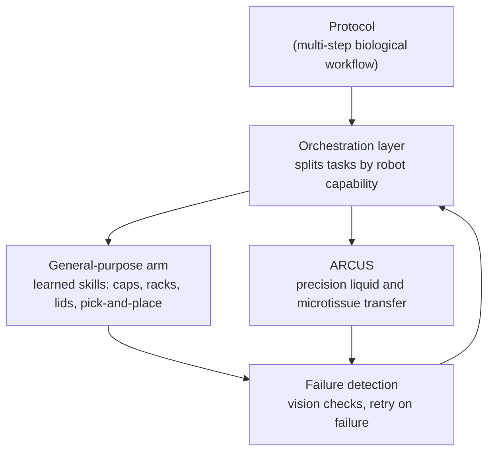

# IMBS Lab, NCKU

**Engineering meets biology: in vitro models, and the robots that build them.**

Department of Biomedical Engineering · College of Engineering 
National Cheng Kung University, Tainan, Taiwan

---

## About us

We are an interdisciplinary research lab focused on the integration of engineering and biology. Our mission is to
advance the understanding of disease mechanisms by developing **in vitro models of cell and tissue culture**. We
build and share the software and tools behind that work here.

### Research areas

| | |
|---|---|
| **Cell and tissue culture models** | In vitro systems for studying disease mechanisms |
| **Tumor microenvironment** | Modeling cancer metastasis |
| **Liver tissue metabolism** | Tissue-level metabolic studies |
| **Mechanobiology** | How mechanical stimulation drives ligament degradation |
| **Lab automation and robotics** | Gentle, repeatable handling of biological samples |

---

## Robotics: ARCUS

Many of our experiments depend on moving small, delicate samples such as liquids, cells and tumor microtissue
cuboids, a few hundred micrometres across, between dishes and well plates. By hand this is slow and varies from
person to person, and commercial liquid handlers are built for repetitive dispensing, not for intact microtissues.

**ARCUS** (*Automated Robotic Cuboid Handling and Unified Sampling*) is our answer: a robotic pipetting platform
built around a Dobot MG400 arm.

  
  
  

| | |
|---|---|
| 🧪 **Robotic pipetting** | The wrist axis drives a syringe plunger, so one arm picks up tips, aspirates and dispenses. |
| 👁️ **Vision-guided positioning** | Cameras and a pixel-to-robot calibration locate the sample and the target well. YOLO-based detection finds tips and microtissue cuboids. |
| 🧬 **Sample-specific transfer** | Separate protocols for liquids, cells and microtissues, each with its own speed and dwell behaviour so delicate samples arrive intact. |
| 🧫 **Standard labware** | 96-well and 6-well plates, Eppendorf tubes and Petri dishes, taught from a few corner points. |
| 🖥️ **Desktop app** | Setup, calibration, batch transfers and manual control in one interface. |

Next, we are working toward loading microtissues directly onto microfluidic and organ-on-a-chip devices.

---

## In progress: learning-based robotics

  
  
  

ARCUS is precise but hand-engineered: every motion is scripted. Real lab workflows also need flexible handling, such
as opening tube caps, loading racks and handling plate lids, where a fixed script breaks as soon as an object sits
slightly differently. We are building toward a platform that pairs the two.

| Thread | What we are doing |
|---|---|
| **Imitation learning** | A general-purpose arm learns manipulation skills from demonstrations, using vision-language-action (VLA) models as the policy. |
| **Simulation with NVIDIA Isaac Sim** | We build the arm and lab objects (tubes, caps, plates, racks) in simulation, generate and augment training data there, and work on transferring the skills to the real arm (sim-to-real). |
| **Orchestration** | A task layer splits a protocol between the learned arm and ARCUS, which stays the precision instrument. |
| **Failure detection** | Vision-based checks spot a failed step and trigger a retry instead of failing silently. |

> **Status:** early stage. The long-term goal is a full multi-step biological protocol that runs autonomously from
> start to finish.

---

## Projects

| Repository | Description |
|---|---|
| [**arcus**](https://github.com/imbsl-ncku/arcus) |  Control software for the ARCUS pipetting robot: transfers, calibration, vision and desktop app. |

<!-- Add a row per repo. Private repos show as a dead link to anyone outside the org. -->

---

## Working with us

- **Collaborations and questions:** Prof. Ting-Yuan Tu, [tytu@bme.ncku.edu.tw](mailto:tytu@bme.ncku.edu.tw)
- **Contributing:**  
  every repo has a `CONTRIBUTING.md`. In short: work on a branch, write
  [Conventional Commits](https://www.conventionalcommits.org/en/v1.0.0/), and open a pull request into `main`.

> [!WARNING]
> Several of our projects move real hardware. Read a repository's safety rules before running anything on a robot.

Each repository states its own license.
